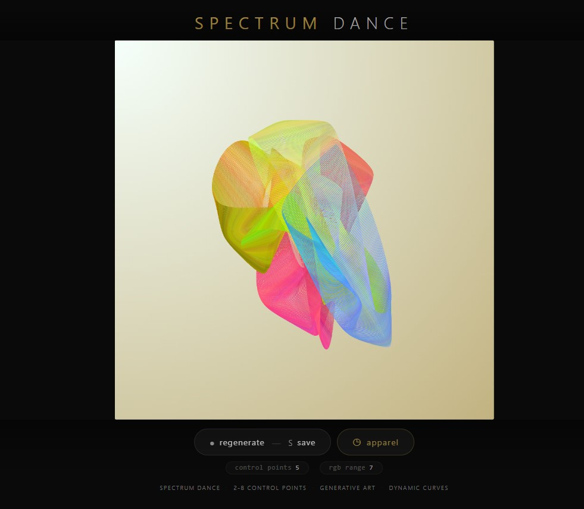
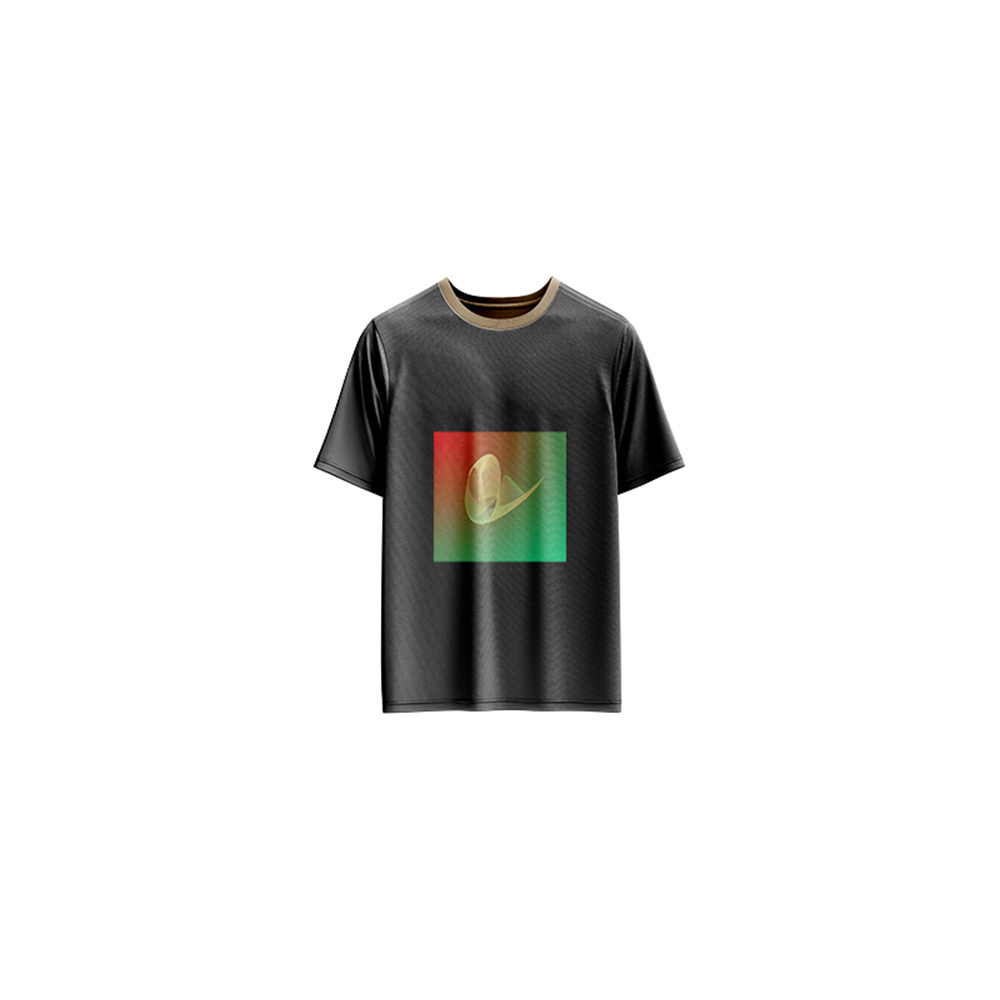

# Spectrum Dance — Generative Art

[](https://reyrove.github.io/Spectrum-Dance-Generative-Art)
[](https://opensource.org/licenses/MIT)

> **Generative curve art with dynamic color shifting.** Each refresh creates a unique dancing curve with 2-8 control points, smoothly shifting colors as it moves across a gradient background.

## 🎨 Live Demo

<div align="center">
  <a href="https://reyrove.github.io/Spectrum-Dance-Generative-Art" target="_blank">
    
  </a>
  <br><br>
  <a href="https://reyrove.github.io/Spectrum-Dance-Generative-Art" target="_blank">
    
  </a>
  <br>
  <em>Click the image or button to experience the generative art</em>
</div>

## 👕 Apparel Preview

<div align="center">
  
  <br>
  <em>Spectrum Dance artwork printed on a T-shirt</em>
</div>

## ✨ Features

- **Dynamic Curves** — Smooth Catmull-Rom curves with 2-8 control points
- **Color Shifting** — Colors dance and shift through the spectrum
- **Gradient Background** — Two random colors blended diagonally
- **Infinite Variation** — Each refresh creates unique parameters
- **Animated** — Curves flow and morph continuously
- **Save & Share** — Download as PNG
- **Apparel Mode** — Preview artwork on a T-shirt mockup
- **Responsive** — Works on desktop, tablet, and mobile
- **p5.js Powered** — Built with the creative coding library
- **Keyboard Shortcuts**:
  - `R` — Regenerate
  - `S` — Save image
  - `T` — Toggle apparel view
  - `Space` — Regenerate

## 🎨 Artwork Details

| Parameter | Range | Description |
|-----------|-------|-------------|
| **Control Points** | 2–8 | Number of curve control points |
| **RGB Range** | 1–10 | Color shift speed |
| **Background Colors** | 2 random | Gradient blend |
| **Angle Speed** | 1/20000 | Curve animation speed |
| **Stroke Weight** | Variable | Based on canvas size |

## 🎯 Color Features

### Background Gradients
- Two random colors from 200+ options
- Diagonal gradient blending
- Creates unique atmospheres

### Curve Colors
- Start with random RGB values
- Shift smoothly within ±RGB range
- Constrained to 0–255
- Constant color evolution

## 🚀 Quick Start

### Local Development

```bash
# Clone the repository
git clone https://github.com/reyrove/Spectrum-Dance-Generative-Art.git

# Navigate to the directory
cd Spectrum-Dance-Generative-Art

# Open in browser
open index.html
# or use a live server
```

### Deploy to GitHub Pages

1. Push to GitHub
2. Go to Settings → Pages
3. Select branch `main` and root folder
4. Your site will be live at `https://reyrove.github.io/Spectrum-Dance-Generative-Art`

## 🧠 How It Works

The artwork generates dynamic curves using linked pendulum-like motion:

1. **Setup**:
   - Random background gradient (2 colors from 200+)
   - Random control points (2–8)
   - Random RGB shift range (1–10)
   - Random starting colors

2. **Motion**:
   - Each control point moves like a pendulum
   - Linked points create fluid, organic motion
   - Unique speeds and phases for each point
   - Continuous animation

3. **Rendering**:
   - Smooth Catmull-Rom curves (p5.js curveVertex)
   - Dynamic stroke color shifting
   - No fill, pure line art
   - Background gradient provides depth

## 📁 File Structure

```
Spectrum-Dance-Generative-Art/
├── index.html          # Main application (all-in-one)
├── Spectrum-Dance.jpg  # T-shirt mockup image
├── fav.svg             # Favicon
├── demo-screenshot.jpg # Website demo screenshot
├── README.md           # This file
└── LICENSE             # MIT License
```

## 🛠️ Tech Stack

- **p5.js** — Creative coding library
- **Canvas API** — 2D rendering
- **CSS Flexbox/Grid** — Responsive layout
- **GitHub Pages** — Hosting

## 🎯 Interactive Controls

| Action | Keyboard | Button |
|--------|----------|--------|
| Regenerate | `R` or `Space` | Click "regenerate" |
| Save Image | `S` | Click "regenerate" |
| Toggle Apparel | `T` | Click "apparel" |

## 🎨 The Creative Process

### Dynamic Curves
Each curve is generated using linked pendulum motion. Control points swing with different speeds and phases, creating fluid, organic movements that never repeat.

### Color Evolution
Colors shift continuously through the spectrum. Starting from random RGB values, each frame adds a small random delta, creating a smooth, unpredictable color dance.

### Gradient Backgrounds
Two random colors blend diagonally across the canvas. The gradient provides depth and contrast, making the shifting curve colors pop.

### Catmull-Rom Smoothness
Using p5.js curveVertex, the curves are rendered as smooth Catmull-Rom splines, creating elegant, flowing lines that feel alive.

## 📱 Responsive Design

The application automatically adapts to:
- Desktop screens
- Tablets
- Mobile phones
- Landscape orientation
- Various aspect ratios
- Small screens (down to 380px wide)

## 🤝 Contributing

Contributions are welcome! Feel free to:
- Fork the repository
- Create a feature branch
- Submit a pull request

### Ideas for Contributions:
- Additional motion patterns
- New color palettes
- Interactive controls
- Performance optimizations
- More apparel mockups

## 📄 License

MIT License — see [LICENSE](LICENSE) file for details.

## 🙏 Acknowledgments

- Created with p5.js
- Inspired by pendulum motion and color theory
- Special thanks to the creative coding community

---

**Built with ❤️ and dancing dreams**